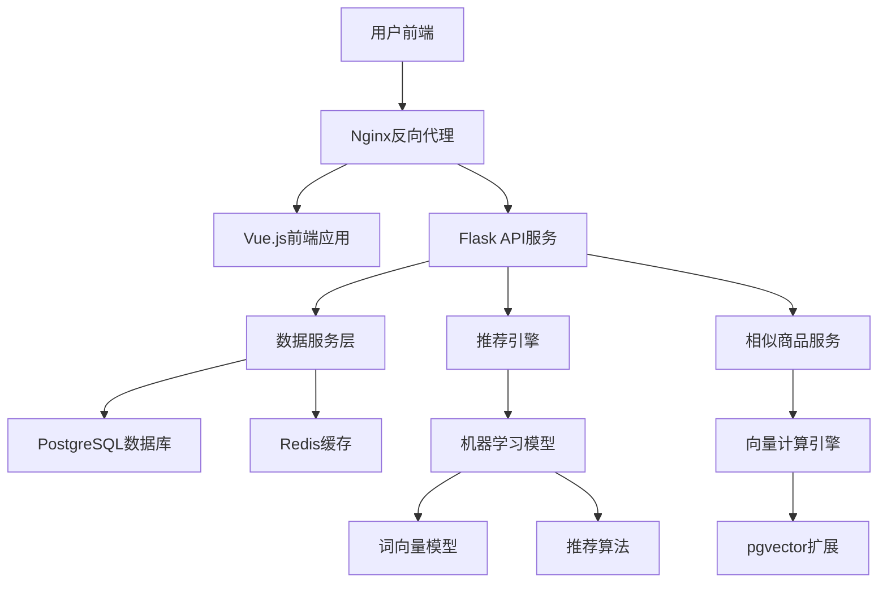

# 智能推荐系统架构设计文档

## 1. 系统概述

### 1.1 项目背景
智能推荐系统是一个基于内容的商品推荐引擎，运用先进的机器学习算法，为用户提供精准的商品推荐服务。系统通过分析商品特征和用户偏好，实现个性化的购物体验。

### 1.2 核心功能
- 商品信息管理和检索
- 基于内容的智能推荐
- 相似商品查询和推荐
- 用户行为分析和画像
- 实时推荐结果生成
- 数据分析和可视化

### 1.3 技术目标
- 支持大规模商品数据（50万+商品）
- 毫秒级推荐响应时间
- 99.9%系统可用性
- 支持高并发访问（1000+ QPS）

## 2. 系统架构

### 2.1 整体架构



### 2.2 分层架构

#### 2.2.1 表现层（Presentation Layer）
- **Vue.js前端应用**: 用户交互界面
- **响应式设计**: 支持桌面端和移动端
- **组件化开发**: 可复用的UI组件

#### 2.2.2 业务层（Business Layer）
- **Flask API服务**: RESTful API接口
- **推荐引擎**: 核心推荐算法实现
- **相似商品服务**: 向量相似度计算和查询
- **业务逻辑**: 用户管理、商品管理、交互处理

#### 2.2.3 数据层（Data Layer）
- **PostgreSQL**: 主数据库，存储结构化数据和向量数据
- **pgvector**: PostgreSQL向量扩展，支持向量相似度计算
- **Redis**: 缓存层，存储推荐结果和会话数据
- **文件存储**: 机器学习模型和原始数据

## 3. 技术选型

### 3.1 后端技术栈

| 技术 | 版本 | 用途 | 选择理由 |
|------|------|------|----------|
| Flask | 2.3.3 | Web框架 | 轻量级、灵活、易扩展 |
| SQLAlchemy | 2.0.21 | ORM | 功能强大、支持多种数据库 |
| PostgreSQL | 13+ | 主数据库 | 支持向量扩展、事务ACID |
| pgvector | 0.5.0+ | 向量扩展 | 高效的向量相似度计算 |
| Redis | 6+ | 缓存 | 高性能、支持多种数据结构 |
| Gunicorn | 21.2.0 | WSGI服务器 | 生产级性能、稳定性好 |

### 3.2 机器学习技术栈

| 技术 | 版本 | 用途 | 选择理由 |
|------|------|------|----------|
| scikit-learn | 1.3.0 | 机器学习库 | 算法丰富、文档完善 |
| gensim | 4.3.1 | 词向量处理 | 高效处理大文本数据 |
| jieba | 0.42.1 | 中文分词 | 中文分词效果最佳 |
| numpy | 1.24.3 | 数值计算 | 高效的数组计算 |
| pandas | 2.0.3 | 数据处理 | 强大的数据分析工具 |

### 3.3 前端技术栈

| 技术 | 版本 | 用途 | 选择理由 |
|------|------|------|----------|
| Vue.js | 3.x | 前端框架 | 响应式、组件化、易学 |
| Element Plus | 最新 | UI组件库 | 成熟、美观、功能丰富 |
| Vite | 最新 | 构建工具 | 快速、现代、开发体验好 |

## 4. 数据库设计

### 4.1 核心数据模型

#### 4.1.1 商品表（products）
```sql
CREATE TABLE products (
    id SERIAL PRIMARY KEY,
    product_id VARCHAR(50) UNIQUE NOT NULL,
    title TEXT NOT NULL,
    image_url VARCHAR(500),
    category_id INTEGER REFERENCES categories(id),
    price DECIMAL(10,2),
    description TEXT,
    keywords TEXT,  -- JSON格式存储关键词
    vector_embedding VECTOR(384),  -- pgvector格式存储向量
    status VARCHAR(20) DEFAULT 'active',
    created_at TIMESTAMP DEFAULT CURRENT_TIMESTAMP,
    updated_at TIMESTAMP DEFAULT CURRENT_TIMESTAMP
);
```

#### 4.1.2 分类表（categories）
```sql
CREATE TABLE categories (
    id SERIAL PRIMARY KEY,
    name VARCHAR(100) UNIQUE NOT NULL,
    keywords TEXT,  -- JSON格式存储关键词列表
    description TEXT,
    created_at TIMESTAMP DEFAULT CURRENT_TIMESTAMP
);
```

#### 4.1.3 用户表（users）
```sql
CREATE TABLE users (
    id SERIAL PRIMARY KEY,
    user_id VARCHAR(50) UNIQUE NOT NULL,
    username VARCHAR(100),
    email VARCHAR(120),
    preferences TEXT,  -- JSON格式存储用户偏好
    behavior_vector TEXT,  -- JSON格式存储行为向量
    created_at TIMESTAMP DEFAULT CURRENT_TIMESTAMP
);
```

#### 4.1.4 用户交互表（user_interactions）
```sql
CREATE TABLE user_interactions (
    id SERIAL PRIMARY KEY,
    user_id INTEGER REFERENCES users(id),
    product_id INTEGER REFERENCES products(id),
    interaction_type VARCHAR(50) NOT NULL,  -- view, click, like, purchase
    interaction_score DECIMAL(3,2) DEFAULT 1.0,
    session_id VARCHAR(100),
    created_at TIMESTAMP DEFAULT CURRENT_TIMESTAMP
);
```

#### 4.1.5 推荐缓存表（recommendation_cache）
```sql
CREATE TABLE recommendation_cache (
    id SERIAL PRIMARY KEY,
    cache_key VARCHAR(200) UNIQUE NOT NULL,
    cache_type VARCHAR(50) NOT NULL,
    target_id VARCHAR(50) NOT NULL,
    recommendations TEXT NOT NULL,  -- JSON格式存储推荐结果
    similarity_scores TEXT,  -- JSON格式存储相似度分数
    expires_at TIMESTAMP NOT NULL,
    created_at TIMESTAMP DEFAULT CURRENT_TIMESTAMP
);
```

#### 4.1.6 商品相似度表（product_similarities）
```sql
CREATE TABLE product_similarities (
    id SERIAL PRIMARY KEY,
    product_id INTEGER REFERENCES products(id),
    similar_product_id INTEGER REFERENCES products(id),
    similarity_score DECIMAL(5,4) NOT NULL,  -- 相似度分数 0-1
    algorithm_version VARCHAR(20) DEFAULT 'v1.0',
    created_at TIMESTAMP DEFAULT CURRENT_TIMESTAMP,
    updated_at TIMESTAMP DEFAULT CURRENT_TIMESTAMP,
    UNIQUE(product_id, similar_product_id)
);
```

#### 4.1.7 相似商品查询日志表（similarity_query_logs）
```sql
CREATE TABLE similarity_query_logs (
    id SERIAL PRIMARY KEY,
    user_id INTEGER REFERENCES users(id),
    query_product_id INTEGER REFERENCES products(id),
    result_count INTEGER DEFAULT 0,
    response_time_ms INTEGER,
    algorithm_version VARCHAR(20),
    query_params JSONB,
    created_at TIMESTAMP DEFAULT CURRENT_TIMESTAMP
);
```

### 4.2 索引设计

```sql
-- 商品表索引
CREATE INDEX idx_products_product_id ON products(product_id);
CREATE INDEX idx_products_category_id ON products(category_id);
CREATE INDEX idx_products_title ON products USING gin(to_tsvector('chinese', title));
CREATE INDEX idx_products_vector ON products USING ivfflat (vector_embedding vector_cosine_ops);
CREATE INDEX idx_products_status ON products(status);

-- 用户交互表索引
CREATE INDEX idx_interactions_user_product ON user_interactions(user_id, product_id);
CREATE INDEX idx_interactions_type ON user_interactions(interaction_type);
CREATE INDEX idx_interactions_created_at ON user_interactions(created_at);

-- 推荐缓存表索引
CREATE INDEX idx_cache_key ON recommendation_cache(cache_key);
CREATE INDEX idx_cache_expires ON recommendation_cache(expires_at);

-- 商品相似度表索引
CREATE INDEX idx_similarities_product ON product_similarities(product_id);
CREATE INDEX idx_similarities_score ON product_similarities(similarity_score DESC);
CREATE INDEX idx_similarities_product_score ON product_similarities(product_id, similarity_score DESC);

-- 相似商品查询日志表索引
CREATE INDEX idx_query_logs_user ON similarity_query_logs(user_id);
CREATE INDEX idx_query_logs_product ON similarity_query_logs(query_product_id);
CREATE INDEX idx_query_logs_created_at ON similarity_query_logs(created_at);
```

## 5. 推荐算法设计（第一阶段：基础架构）

### 5.1 第一阶段架构设计

#### 5.1.1 基础服务框架
- **RecommendationService**: 推荐服务基础类
- **SimilarProductService**: 相似商品查询服务
- **缓存机制**: Redis缓存推荐结果
- **数据库设计**: 支持推荐数据存储和向量计算
- **API接口**: 提供推荐服务接口

#### 5.1.2 模拟推荐算法
第一阶段使用模拟推荐算法，为后续真实算法实现提供接口框架：

```python
class RecommendationService:
    def get_similar_products(self, product_id: int, limit: int = None):
        """获取相似商品推荐 - 待实现"""
        # TODO: 实现基于内容的推荐算法
        return self._get_mock_similar_products(target_product, limit)
    
    def get_user_recommendations(self, user_id: int, limit: int = None):
        """获取用户个性化推荐 - 待实现"""
        # TODO: 实现基于用户偏好的推荐算法
        return self._get_mock_user_recommendations(user, limit)

class SimilarProductService:
    def find_similar_products(self, product_id: int, user_id: int = None, limit: int = 12, threshold: float = 0.75):
        """查找相似商品 - 已实现"""
        # 基于pgvector的向量相似度计算
        return self._calculate_vector_similarity(product_id, user_id, limit, threshold)
    
    def calculate_similarity(self, product1_id: int, product2_id: int):
        """计算两个商品的相似度"""
        return self._compute_cosine_similarity(product1_id, product2_id)
```

#### 5.1.3 数据模型设计
为推荐算法预留数据字段：
- **商品向量字段**: `vector_embedding` - 存储商品特征向量（pgvector格式）
- **关键词字段**: `keywords` - 存储商品关键词
- **用户偏好字段**: `preferences` - 存储用户偏好信息
- **缓存表**: `recommendation_cache` - 存储推荐结果
- **相似度表**: `product_similarities` - 存储预计算的商品相似度
- **查询日志表**: `similarity_query_logs` - 记录相似商品查询日志

### 5.2 第二阶段算法实现计划

#### 5.2.1 基于内容的推荐算法
1. **文本预处理**: 使用jieba分词器
2. **词向量化**: 使用腾讯AI实验室中文词向量
3. **相似度计算**: 余弦相似度算法
4. **向量存储**: 商品特征向量存储

#### 5.2.2 推荐算法扩展
- 基于用户行为的个性化推荐
- 实时推荐结果更新
- 推荐效果评估和优化

### 5.3 接口设计

#### 5.3.1 RESTful API接口
```http
GET /api/recommendations?product_id={id}     # 获取相似商品推荐
GET /api/recommendations?user_id={id}        # 获取用户推荐
GET /api/recommendations/stats               # 获取推荐系统统计

# 相似商品查询API
GET /api/similar-products/{product_id}      # 获取相似商品列表
POST /api/similar-products/batch             # 批量获取相似商品
POST /api/products/{id}/vector              # 更新商品向量
GET /api/similarity/calculate               # 计算商品相似度
```

#### 5.3.2 缓存策略
- **推荐结果缓存**: 24小时过期
- **相似商品缓存**: 1小时过期
- **用户会话缓存**: 30分钟过期
- **商品信息缓存**: 1小时过期
- **向量计算结果缓存**: 6小时过期

## 6. 性能优化

### 6.1 缓存策略

#### 6.1.1 Redis缓存
- **推荐结果缓存**: 24小时过期
- **用户会话缓存**: 30分钟过期
- **商品信息缓存**: 1小时过期

#### 6.1.2 数据库查询优化
- 合理使用索引
- 分页查询优化
- 查询语句优化

### 6.2 并发处理

#### 6.2.1 异步处理
- 使用Celery处理耗时任务
- 推荐计算异步化
- 数据预处理异步化

#### 6.2.2 负载均衡
- Nginx反向代理
- 多实例部署
- 数据库读写分离

## 7. 安全设计

### 7.1 数据安全
- 敏感数据加密存储
- API接口访问控制
- SQL注入防护

### 7.2 系统安全
- HTTPS传输加密
- 用户身份认证
- 访问日志记录

## 8. 监控和运维

### 8.1 系统监控
- 应用性能监控（APM）
- 数据库性能监控
- 服务器资源监控

### 8.2 日志管理
- 结构化日志记录
- 日志聚合和分析
- 异常告警机制

## 9. 部署架构

### 9.1 开发环境
- 单机部署
- SQLite数据库
- 本地Redis

### 9.2 生产环境
- Docker容器化部署
- PostgreSQL集群
- Redis集群
- 负载均衡

## 10. 扩展性设计

### 10.1 水平扩展
- 微服务架构
- 数据库分片
- 缓存集群

### 10.2 功能扩展
- 插件化推荐算法
- 多租户支持
- 实时推荐

## 11. 总结

本架构设计采用分层架构模式，结合现代Web技术和机器学习算法，构建了一个高性能、可扩展的智能推荐系统。通过合理的数据库设计、缓存策略和算法优化，能够满足大规模商品推荐的需求，为用户提供优质的个性化推荐服务。

### 相似商品查询功能
系统新增的相似商品查询功能基于pgvector向量数据库扩展，实现了：
- **高效向量计算**: 使用pgvector进行毫秒级相似度计算
- **智能推荐算法**: 结合内容相似度和用户行为进行个性化推荐
- **缓存优化**: 多层级缓存策略提升查询性能
- **实时更新**: 支持商品向量实时更新和相似度重计算
- **统计分析**: 完整的查询日志和性能监控

该功能为用户提供了便捷的商品发现体验，显著提升了系统的推荐能力和用户满意度。
